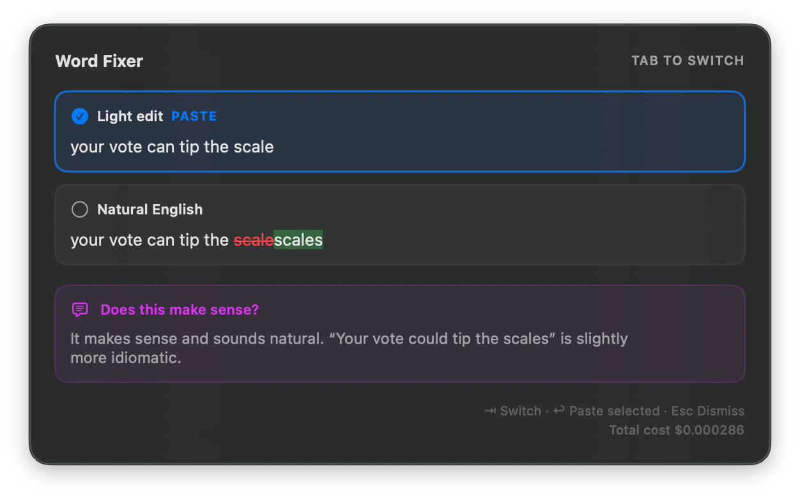

# Word Fixer

https://github.com/user-attachments/assets/49385317-fbf7-4dac-b86a-926a70f3a979



Word Fixer reviews selected text with Pi and offers two pasteable revisions plus a concise English-usage takeaway. It has two platform frontends:

- **macOS 14+** — the existing menu bar app, using Accessibility (AX) for capture and replacement with clipboard copy/paste only as a fallback.
- **Omarchy** — a native Quickshell overlay in the existing `omarchy-shell` process, using Hyprland and the Wayland clipboard for capture and safe paste-back.

Both frontends use the same locked helper runtime and review contract. The Linux implementation does not replace or weaken macOS's AX-first behavior.

## Review behavior

Each review runs three fresh in-memory Pi SDK sessions concurrently:

1. **Light edit** — spelling and obvious grammar corrections without unnecessary rewriting.
2. **Natural English** — the smallest rewrite that sounds idiomatic while preserving the writer's voice.
3. **Takeaway** — a short note about clarity and naturalness.

The helper always requests `openai-codex/gpt-5.4-mini`, sets thinking to `off`, and passes `noTools: "all"`. It refuses model fallback. Sessions are disposed after every success, error, cancellation, or timeout; there is no conversation history or persistent Pi session.

Prompts and model settings are app-specific, while authentication remains in Pi's canonical file:

```text
~/.config/word-fixer/.pi/       # Word Fixer prompts and Pi settings
~/.pi/agent/auth.json           # canonical shared Pi authentication
```

Word Fixer never copies OAuth credentials into its own config.

## macOS

### Flow

Press **⌘⇧C** after selecting text:

1. Read the focused text element, selected text, and selected range through macOS Accessibility APIs.
2. Capture through simulated copy only when the application does not expose a safe AX capture/replacement path.
3. Run the three-part review through the local Node helper.
4. Show both inline-diff choices and the takeaway.
5. On Enter, write the selected choice back to the same AX element/range. Clipboard paste remains the compatibility fallback only.

The fallback is less reliable than AX and is not the preferred architecture.

### Requirements and development

- macOS 14+
- Swift 5.10+
- Node.js 22.19 or newer and npm
- `pi` installed with canonical authentication ready for `openai-codex/gpt-5.4-mini`
- Accessibility permission for the installed app, or for the terminal when using `swift run`

```bash
swift build
make runtime
swift run
# or
make build
make run
```

Install for the current user and open the stable app path:

```bash
make install
open "$HOME/Applications/Word Fixer.app"
```

The installer verifies the dedicated model and canonical authentication, installs the locked SDK under app data, records a dedicated Node link, and seeds only missing prompts and settings before launch. Existing prompt customization is preserved.

Other packaging targets:

```bash
make package          # dist/Word Fixer.app
make install-system   # /Applications/Word Fixer.app
make reinstall        # reinstall user app and open it
```

Use one installed app path consistently when granting Accessibility access. If needed, enable it under **System Settings → Privacy & Security → Accessibility**.

### macOS configuration

The existing Swift frontend uses:

```text
~/.config/word-fixer/config.json
```

Its fields are:

- `shortcutKey` and `shortcutModifiers` — global hotkey.
- `nodeBinaryPath` — dedicated Node runtime link created by the installer.
- `debugLogging` — writes verbose logs under app data when enabled.

The packaged `shared/prompts/` and `shared/settings.json` defaults are seeded only when their destination files are missing. The helper state, locked SDK, model store, and debug log use `~/.local/share/word-fixer/` (or `$XDG_DATA_HOME/word-fixer/`), matching Omarchy.

## Omarchy

### Requirements

The installer checks the actual runtime before changing files. A supported setup requires:

- Omarchy with Hyprland and a running `omarchy-shell`.
- Node.js **22.19 or newer**, npm, and `jq`.
- `wl-copy`/`wl-paste`, `hyprctl`, and `notify-send`.
- `omarchy`, `omarchy-shell`, and `pi` on `PATH`.
- `~/.local/bin` on `PATH`.
- Canonical Pi auth at `~/.pi/agent/auth.json`, ready for `openai-codex/gpt-5.4-mini`.
- Network access, or a populated app npm cache, for the first locked SDK installation.

This frontend is Omarchy-specific. It is not a standalone desktop application and does not support arbitrary Wayland compositors.

### Install and check

From a checkout that will remain at a stable path:

```bash
./linux/install
./linux/install --check
```

The installation is idempotent. It:

- validates the model, canonical auth, manifest, and running shell;
- installs the locked `@earendil-works/pi-coding-agent@0.84.4` SDK under `~/.local/share/word-fixer/sdk/` (or `$XDG_DATA_HOME/word-fixer/sdk/`);
- records a dedicated Node executable link in app support state;
- links the repository as the `hazat.word-fixer` overlay/bar-widget plugin, enables it, and places its status icon in the right bar section;
- links `linux/bin/word-fixer` into `~/.local/bin/word-fixer`;
- seeds only missing prompt and settings files.

Existing prompt bytes are never overwritten. Existing compatible settings are also retained. `--check` is non-destructive and fails clearly if installation or dedicated model settings are incomplete; no fallback model is selected.

On a machine using the managed `~/omarchy-config` setup in this repository's development environment, `word-fixer-setup` is a wrapper around the same installer and accepts `--check`.

### Bar status icon

The installer places the Word Fixer icon in the right side of the Omarchy bar. The idle icon means the plugin is installed, enabled, and ready for **SUPER+SHIFT+C**; it changes to the active color while a review owns the single-instance lock. Hover for status and click for a reminder of the shortcut.

Word Fixer does not keep a model process running continuously. The overlay stays loaded inside `omarchy-shell`, while the Node helper starts on demand and exits after its idle timeout. The persistent bar icon therefore reports **ready**, not a permanently running helper process.

On an existing installation, rerun `./linux/install` once to add the new bar slot. On a new machine, clone the checkout to a stable path, run `./linux/install`, add the binding below (or apply the managed `~/omarchy-config`), and verify with `./linux/install --check`. The installer seeds the locked SDK, prompts, settings, plugin, client link, and bar icon; it intentionally does not edit personal Hyprland bindings.

### Bind SUPER+SHIFT+C

The product installer enables the overlay and client but does not edit personal Hyprland bindings. In the managed Omarchy binding file, explicitly replace the stock HEY Calendar chord:

```lua
-- SUPER+SHIFT+C replaces the stock HEY Calendar shortcut.
hl.unbind("SUPER + SHIFT + C")
o.bind("SUPER + SHIFT + C", "Word Fixer", function()
  dofile((os.getenv("HOME") or "") .. "/.config/omarchy/plugins/hazat.word-fixer/linux/hypr/word-fixer.lua").capture()
end, { release = true })
```

Reload and inspect the live binding:

```bash
hyprctl reload
test -z "$(hyprctl configerrors)"
omarchy menu keybindings --print | rg 'SUPER SHIFT \+ C|Word Fixer|Calendar'
```

The result should identify **SUPER SHIFT + C** as **Word Fixer**, not HEY Calendar.

### Flow and controls

1. Select non-empty text in the source application.
2. Press **SUPER+SHIFT+C**.
3. Word Fixer records the source window address, PID, class, and terminal classification before opening the overlay.
4. After the triggering key callback has returned, the external client clears the old clipboard, verifies the source, sends the appropriate copy chord, and reads selected plain text with `wl-paste`.
5. A centered, theme-aware loading overlay opens while the shared helper performs the three concurrent reviews.
6. Review **Light edit**, **Natural English**, and the bottom **Takeaway** card.

Controls:

- **Tab / Shift+Tab** — cycle the two paste choices.
- **Click a choice card** — select it.
- **Enter** — accept and paste the selected choice.
- **Escape** or **click outside** — cancel without changing source text.

Long reviews stay inside a height-bounded scrolling panel. Selected text and model output are escaped before rich diff styling, so markup-shaped input is displayed literally.

### Paste safety and errors

Acceptance first closes the overlay and places only the chosen correction on the plain-text Wayland clipboard. Word Fixer then requires the captured source window to still match its original **address, PID, and initial class**, restores focus, verifies the same target again, and only then injects paste:

- normal windows: **Ctrl+C** / **Ctrl+V**;
- windows tagged `terminal`: **Ctrl+Insert** / **Shift+Insert**.

If the source disappeared, focus could not be restored, or the active target does not match exactly, Word Fixer **refuses to paste into any window**. It sends a critical desktop notification and leaves the accepted correction on the clipboard for manual recovery.

Empty capture, duplicate invocation, malformed helper/model output, request failure, cancellation, and timeout do not paste or modify source text. Review failures become an actionable overlay error when possible; dismiss it and retry the shortcut. Request directories and the single-review lock are cleaned on completion and failure.

Recovery:

- If capture is empty, reselect non-empty text and retry.
- If the review reports an error, dismiss it and retry; model and helper failures never trigger a fallback model.
- If exact-target verification refuses paste, return to the intended field and paste manually—the accepted correction is already on the clipboard.
- If installation check reports missing canonical auth, sign in with `pi` and rerun it. For a locked SDK installation error, restore network access or populate `~/.local/share/word-fixer/npm-cache/`, then rerun the installer.

Important clipboard behavior on Omarchy:

- Invoking Word Fixer clears the previous clipboard before copying the selection.
- Accepted output intentionally remains on the clipboard after paste, including after an exact-target refusal.
- Previous rich clipboard MIME data is **not** restored, even after cancellation or error.
- Transport and paste are plain text; rich clipboard preservation is unsupported.

## Configuration and state

Both frontends respect `XDG_CONFIG_HOME` and `XDG_DATA_HOME`; Omarchy also uses `XDG_RUNTIME_DIR` for request IPC:

```text
~/.config/word-fixer/
├── config.json                 # dedicated nodeBinaryPath, debugLogging
└── .pi/
    ├── SYSTEM.md               # light-edit prompt
    ├── NATURAL.md              # natural-English prompt
    ├── FEEDBACK.md             # takeaway prompt
    ├── settings.json           # dedicated provider/model/thinking settings
    └── models.json             # optional app-specific custom model definitions

~/.local/share/word-fixer/
├── sdk/                        # locked app-owned Pi SDK and loader
├── bin/node                    # dedicated Node executable link
├── helper.json                 # live helper PID/port/version state
├── models-store.json           # SDK runtime model state
├── debug.log                   # only when debug logging is enabled
└── npm-cache/                  # app SDK installation cache

${XDG_RUNTIME_DIR:-/tmp}/word-fixer/
└── active.lock, request-*      # restrictive transient request/overlay IPC
```

The generated Linux settings select:

```json
{
  "defaultProvider": "openai-codex",
  "defaultModel": "gpt-5.4-mini",
  "defaultThinkingLevel": "off",
  "modelThinkingLevels": {
    "openai-codex/gpt-5.4-mini": "off"
  }
}
```

The model is a product invariant, not a user-facing model picker. The helper also enforces it directly and rejects fallback. Edit prompt files to tune behavior; rerunning the installer does not replace customized prompts.

## Architecture

```text
shared/                         # cross-platform prompt and settings defaults
helper/
├── helper-lib.mjs              # config, app SDK, sessions, validation, timeouts
├── word-fixer-helper.mjs       # bounded loopback HTTP review service
├── sdk-loader.mjs              # locked app-owned SDK entry point
├── package.json
└── package-lock.json

Sources/WordFixer/              # macOS AX/AppKit/SwiftUI frontend and shared paths
Tests/WordFixerTests/           # macOS diff and configuration tests
scripts/bootstrap-runtime.sh    # macOS locked runtime bootstrap

linux/
├── bin/word-fixer              # single-instance Wayland client
├── hypr/word-fixer.lua         # target capture and deferred client launch callback
├── install                     # idempotent installer and --check
├── lib/                        # protocol, diff, helper, target, runtime primitives
├── omarchy/                    # Quickshell overlay and presentation model
└── test/                       # Linux protocol/overlay/orchestration/install tests

manifest.json                   # schema-v1 Omarchy overlay plugin
```

The helper listens only on `127.0.0.1`, advertises a versioned health record in app data, and is reused while healthy. Each request still creates three fresh sessions; the helper exits after an idle timeout.

## Contributor verification

Run the shared and Linux checks:

```bash
node --test helper/helper-lib.test.mjs linux/test/*.test.mjs
for file in helper/helper-lib.mjs helper/sdk-loader.mjs helper/word-fixer-helper.mjs linux/bin/word-fixer linux/lib/*.mjs; do node --check "$file"; done
bash -n linux/install scripts/bootstrap-runtime.sh scripts/install.sh scripts/package-app.sh
luac -p linux/hypr/word-fixer.lua
omarchy plugin validate "$PWD"
```

On macOS, also run:

```bash
swift build
swift test
make package
```

Install and launch the stable `~/Applications/Word Fixer.app` path, verify helper prewarm in the app-data debug log, and perform a real review when canonical authentication is available. For live Omarchy installation or binding changes, also run `./linux/install --check`, inspect the keybinding, reload Hyprland, require empty `hyprctl configerrors`, and run the managed machine-config doctor where applicable.

## Known limitations

- Omarchy only; other compositors and desktop shells are unsupported.
- Linux replacement depends on the source application retaining its selection while the overlay has focus.
- Linux clipboard capture is plain text and discards the previous clipboard, including rich MIME data.
- Terminal detection depends on Omarchy's `terminal` window tag.
- The review is bounded to 64 KiB of UTF-8 input and model/helper timeouts; very large selections are rejected.
- No automatic paste without review, settings UI, model picker, history, or persistent Pi sessions.
